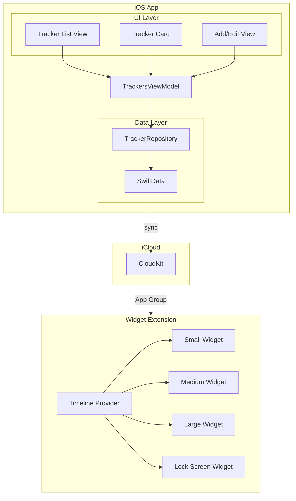
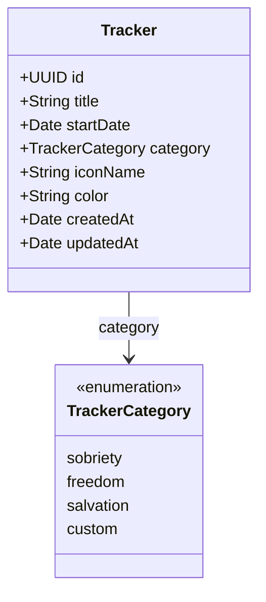
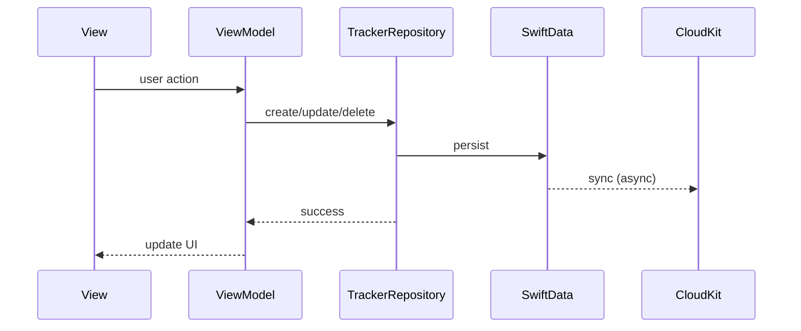
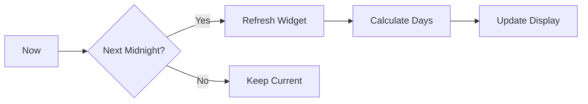

# Renewed - Architecture Overview

## System Context

Renewed is an iOS/macOS app for tracking recovery milestones (sobriety, freedom from addiction, salvation dates). Data syncs via iCloud to all devices.

## High-Level Architecture



## Data Model



### Key Design Decisions

- **SwiftData** handles persistence + CloudKit sync automatically
- **App Group** (`group.com.benniemosher.renewed`) shares data with widgets
- **UUID** primary keys for stable identity across devices
- **Semantic colors** (not hex) for dark mode support

## Repository Pattern



```swift
protocol TrackerRepository {
    func fetchAll() async throws -> [Tracker]
    func create(_ tracker: Tracker) async throws
    func update(_ tracker: Tracker) async throws
    func delete(_ tracker: Tracker) async throws
    func fetch(byId: UUID) async throws -> Tracker?
}
```

## Widget Architecture

### Timeline Provider

Widgets use `TimelineProvider` to refresh at midnight:



```swift
struct Provider: TimelineProvider {
    func timeline(...) {
        // Calculate next midnight
        // Return entries for next 7 days
        // Policy: refresh after midnight
    }
}
```

### Widget Sizes

| Size | Content | Home Screen | Lock Screen |
|------|---------|-------------|-------------|
| Small | 1 tracker, large count | ✅ | ❌ |
| Medium | 2 trackers side-by-side | ✅ | ❌ |
| Large | 4 trackers (2x2 grid) | ✅ | ❌ |
| Inline | Text only (e.g., "42 days") | ❌ | ✅ |
| Rectangular | Small card | ❌ | ✅ |

## Directory Structure

```
Renewed/
├── Sources/
│   ├── Models/           # SwiftData models
│   ├── Repositories/     # Data access layer
│   ├── Services/         # Date calculation, etc.
│   ├── ViewModels/       # MVVM layer
│   ├── Views/
│   │   ├── Components/   # Reusable (TrackerCard, etc.)
│   │   ├── Screens/      # Full screens (TrackerList, etc.)
│   │   └── Widgets/      # Widget-specific views
│   └── RenewedApp.swift  # App entry
├── Tests/
│   ├── Unit/             # Business logic tests
│   └── UI/               # UI tests (critical paths only)
└── RenewedWidget/        # Widget extension
    ├── Views/
    └── Provider.swift
```

## Dependencies

| Dependency | Purpose | Min Version |
|------------|---------|-------------|
| SwiftUI | UI Framework | iOS 16 |
| SwiftData | Persistence | iOS 17 |
| WidgetKit | Widgets | iOS 16 |
| CloudKit | Sync | N/A (system) |

## Security & Privacy

- **No data collection** - All data stays in user's iCloud
- **Private database** - CloudKit private DB, user-only access
- **Keychain** - For any future secrets (none currently)

## Performance Considerations

- SwiftData queries are lazy by default
- Widget timelines refresh at midnight (battery efficient)
- Date calculations cached in view models
- No network calls except CloudKit (system managed)

## Diagram Standards

This project uses [Mermaid](https://mermaid.js.org/) for all diagrams:

- **Flowcharts** for process flows
- **Sequence diagrams** for interactions
- **Class diagrams** for data models
- **Gantt charts** for timelines (if needed)

All diagrams render in GitHub markdown. Keep them simple and focused.

## Links

- [AGENT.md](/AGENT.md) - Agent guide
- [RUNBOOK.md](RUNBOOK.md) - Procedures
- [STATUS.md](STATUS.md) - Project status
- [CHANGELOG.md](/CHANGELOG.md) - Release history
