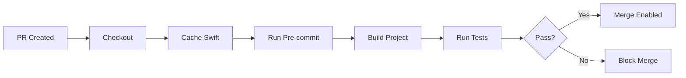

# Renewed - Runbook

Operations procedures for the Renewed project. For architecture, see [ARCHITECTURE.md](ARCHITECTURE.md).

## Development Workflow

### Start Work on a Ticket

```bash
# 1. Get next available ticket
task agent:next

# 2. Create feature branch (kebab-case, no slashes)
git checkout -b feature-XXX-short-description

# 3. Work the ticket (TDD: test → implementation)
# 4. Commit: type: #XXX: Description
git commit -m "feat: #3: Add Taskfile"

# 5. Push and create PR (title matches commit format)
git push -u origin HEAD
gh pr create --title "feat: #3: Add Taskfile" --body "Closes #3"
```

### Pre-Commit Hooks

Installed via pre-commit framework:

```bash
pre-commit install        # One-time setup
pre-commit run --all-files  # Manual run
task lint                  # Via Taskfile
```

Hooks:
- trailing-whitespace
- end-of-file-fixer
- check-yaml
- detect-private-key
- swift-format (if available)
- unit tests

### CI Pipeline

GitHub Actions runs on every PR:



## Testing

### Unit Tests

```bash
task test
```

Test everything that isn't UI:
- Date calculations
- Repository operations
- View model logic

### UI Tests

Critical paths only (create, edit, delete tracker). Most UI testing done manually in Simulator.

### Widget Tests

Test timeline calculation, not widget rendering. Widget appearance tested manually.

## Release Process

### Version Bump

```bash
# Update version in Xcode
# Update CHANGELOG.md
git tag v0.1.0
git push origin v0.1.0
```

### Build .ipa (for TestFlight)

```bash
./scripts/build-ipa.sh
```

### App Store Submission

1. Archive in Xcode
2. Upload to App Store Connect
3. Submit for review
4. Update README with App Store badge

## Troubleshooting

### Pre-commit Fails

```bash
pre-commit run --all-files  # See what's failing
swift-format --version      # Check if installed
```

### SwiftData Migration Issues

- SwiftData handles migrations automatically for additive changes
- Destructive changes require data model versioning
- Test migration on device with existing data

### Widget Not Updating

- Check App Group entitlement
- Verify timeline refresh policy
- Ensure data is saved to shared container

### CloudKit Sync Not Working

- Check CloudKit entitlement
- Verify user is signed into iCloud
- Check CloudKit Dashboard for errors
- Sync is async - wait 30+ seconds

## Project Maintenance

### Update Dependencies

```bash
brew upgrade pre-commit
pre-commit autoupdate
```

### Clean Build

```bash
task clean
rm -rf ~/Library/Developer/Xcode/DerivedData
```

### Reset Simulator

```bash
xcrun simctl erase all
```

## Links

- [AGENT.md](/AGENT.md) - Agent guide
- [ARCHITECTURE.md](ARCHITECTURE.md) - System design
- [GitHub Project](https://github.com/users/benniemosher/projects/2) - Sprint board
